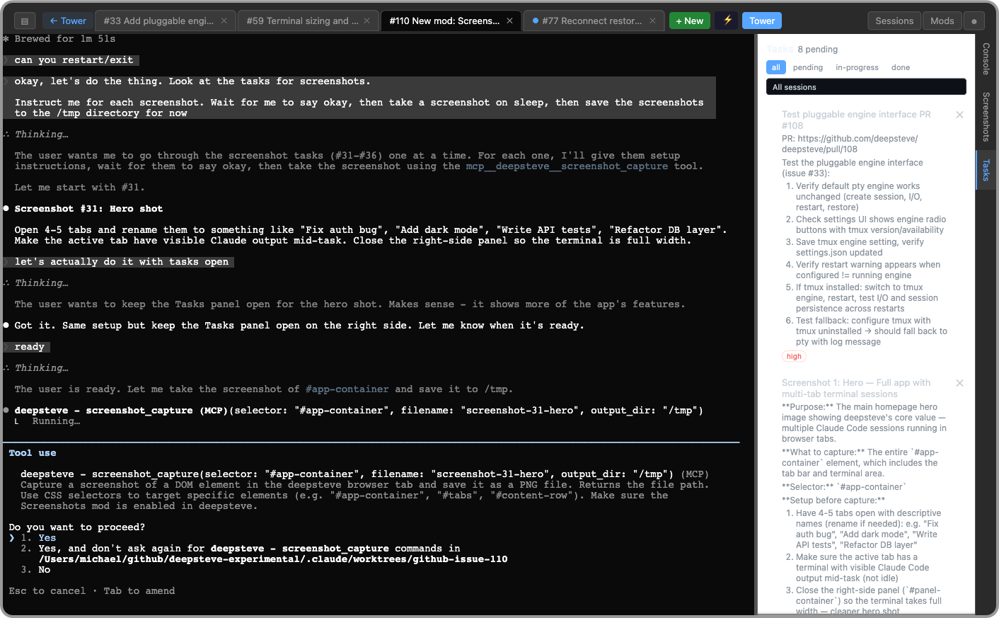
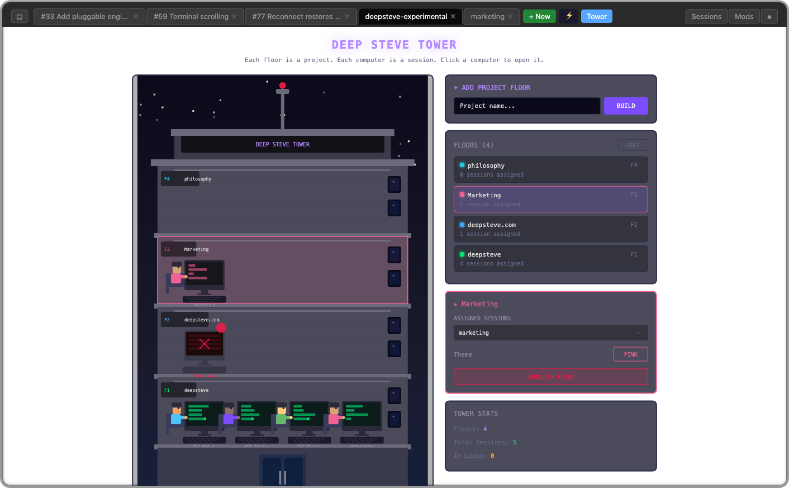
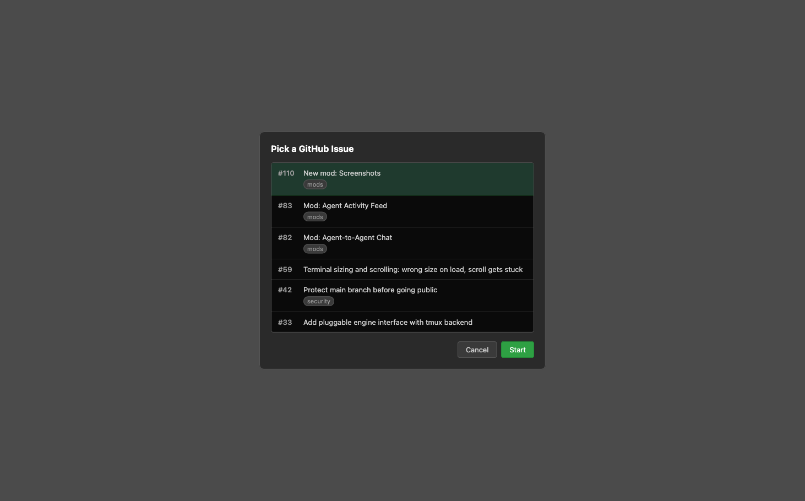

<p align="center">
  
</p>

# deepsteve

https://deepsteve.com

Run multiple Claude Code sessions side-by-side in your browser, each with full terminal capabilities and persistent conversation history.

<p align="center">
  
</p>

<p align="center">
  
  
</p>

**Requires macOS.** deepsteve uses macOS LaunchAgents for daemon management and macOS-specific paths for logs and state.

> **Security notice:** DeepSteve has no authentication, no CORS restrictions, and no WebSocket origin checking. It is designed for **localhost use only**. Do not expose it to a network or the public internet.

## Features

- **Multiple sessions** - Open as many Claude Code instances as you need in separate tabs
- **Real terminal emulation** - Full PTY support via xterm.js, not a fake terminal
- **Session persistence** - Conversations survive server restarts and page refreshes
- **Directory picker** - Start each session in any working directory
- **Runs as a daemon** - Always available in the background on your Mac
- **Themes** - Customize the UI with CSS files in `~/.deepsteve/themes/`
- **Mods** - Extend deepsteve with visual mods (e.g. the pixel art Tower view)

## Quick Install

```bash
curl -fsSL deepsteve.com/install.sh | bash
```

## Requirements

- macOS
- Node.js
- [Claude Code](https://docs.anthropic.com/en/docs/claude-code) CLI installed

## Installation (from source)

If you've cloned the repo:

```bash
./release.sh   # generates install.sh from source files
./install.sh   # installs to ~/.deepsteve/
```

`install.sh` is gitignored — it's generated by `release.sh`, which embeds all source files as heredocs. You must run `release.sh` first.

## Usage

Open [http://localhost:3000](http://localhost:3000) in your browser.

- Click **+** to create a new Claude Code session
- Right-click a tab to rename it
- Use **Shift+Enter** for multi-line input

## Themes

Customize the UI with CSS theme files. See the [Themes Guide](docs/themes.md) for details.

## Mods

Extend deepsteve with visual mods — alternative views, panels, and MCP tools for your sessions. See the [Mods Guide](docs/mods.md) for details.

## Managing the Daemon

```bash
# Restart after making changes
launchctl unload ~/Library/LaunchAgents/com.deepsteve.plist && launchctl load ~/Library/LaunchAgents/com.deepsteve.plist

# View logs
tail -f ~/Library/Logs/deepsteve.log

# Stop
launchctl unload ~/Library/LaunchAgents/com.deepsteve.plist

# Check status
launchctl list | grep deepsteve
```

## Security

- Binds to `localhost:3000` only — not accessible from the network
- No authentication — anyone with local access to the machine can use it
- Each session runs Claude Code with the permissions of the user who installed deepsteve

## Contributing

Bug reports and feature requests are welcome on [GitHub Issues](https://github.com/deepsteve/deepsteve/issues). Pull requests are welcome.

## Uninstall

```bash
~/.deepsteve/uninstall.sh
```
