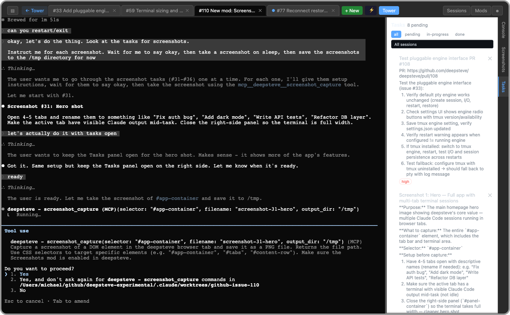
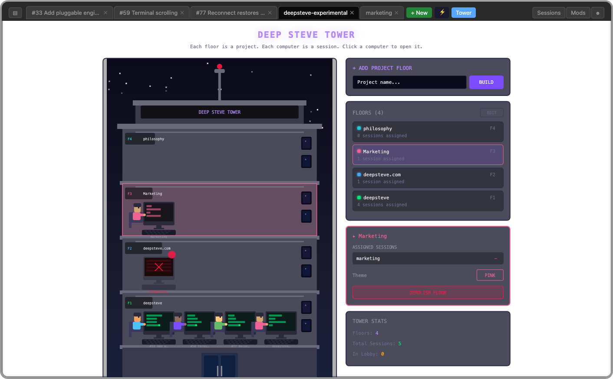
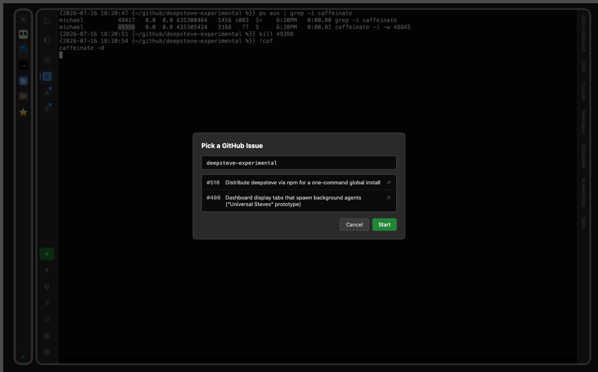

<p align="center">
  
</p>

# deepsteve

https://deepsteve.com

Run multiple AI agent sessions side-by-side in your browser, each with full terminal capabilities and persistent conversation history. Supports **Claude Code** with experimental support for **OpenCode** and **Gemini**.

<p align="center">
  
</p>

<p align="center">
  
  
</p>

**Requires macOS.** deepsteve uses macOS LaunchAgents for daemon management and macOS-specific paths for logs and state.

> **Security notice:** DeepSteve has no authentication, no CORS restrictions, and no WebSocket origin checking. It is designed for **localhost use only**. Do not expose it to a network or the public internet.

## Terminal Engines

deepsteve currently uses **node-pty** to run agent sessions (Claude Code, OpenCode, Gemini) as child processes on a Node server, connected to the browser via WebSocket. **tmux** support is currently being implemented as an alternative backend — running sessions inside tmux panes instead of node-pty, enabling native session persistence and detach/reattach without the Node process staying alive.

## Features

- **Multiple sessions** - Open as many Claude Code, OpenCode, or Gemini instances as you need in separate tabs
- **Real terminal emulation** - PTY support via xterm.js.
- **Session persistence** - Conversations survive server restarts and page refreshes
- **GitHub issue picker** - Pick an issue from any repo and launch a session with a worktree and prompt
- **Agent coordination** - MCP tools let sessions chat, share tasks, and coordinate work
- **Runs as a daemon** - Always available in the background on your Mac
- **Themes** - Customize the UI with CSS files in `~/.deepsteve/themes/`
- **Mods** - Extend deepsteve with mods for task tracking, agent chat, browser reflection (yes, deepsteve can see itself), or [create your own](docs/mods.md)

## Quick Install

```bash
curl -fsSL deepsteve.com/install.sh | bash
```

## Requirements

- macOS
- Node.js
- [Claude Code](https://docs.anthropic.com/en/docs/claude-code), [OpenCode](https://github.com/google/opencode), or [Gemini CLI](https://github.com/google/gemini-cli) installed

## Installation (from source)

If you've cloned the repo:

```bash
./release.sh   # generates install.sh from source files
./install.sh   # installs to ~/.deepsteve/
```

`install.sh` is gitignored — it's generated by `release.sh`, which embeds all source files as heredocs. You must run `release.sh` first.

## Usage

Open [http://localhost:3000](http://localhost:3000) in your browser.

- Click **+** to create a new Claude Code session in any directory
- Click the **GitHub icon** to pick an issue — deepsteve creates a worktree and starts a session with the issue as a prompt
- Right-click a tab to rename it
- Use **Shift+Enter** for multi-line input

## Command Palette

Press **⌘K** to open the command palette for quick keyboard-driven access to tabs, settings, and custom commands.

- Type to filter, arrow keys to navigate, Enter to execute
- Built-in commands: New Tab, Close Tab, Settings, Mods, Next/Previous Tab
- Switch between open tabs by name
- Customize the shortcut in Settings → Keyboard

### Custom Commands

Drop executable scripts into `~/.deepsteve/commands/` and they appear automatically in the palette:

```bash
cat > ~/.deepsteve/commands/hello.sh << 'EOF'
#!/bin/bash
echo "Hello from DeepSteve!"
EOF
chmod +x ~/.deepsteve/commands/hello.sh
```

The command name is derived from the filename (hyphens → spaces, title-cased). For custom names, add a JSON sidecar file alongside the script:

```json
// ~/.deepsteve/commands/hello.json
{ "name": "Say Hello", "description": "Prints a friendly greeting" }
```

Scripts receive two environment variables: `DEEPSTEVE_SESSION_ID` (active tab's shell ID) and `DEEPSTEVE_CWD` (that tab's working directory).

## Themes

Customize the UI with CSS theme files. See the [Themes Guide](docs/themes.md) for details.

## Mods

Extend deepsteve with visual mods — alternative views, panels, and MCP tools for your sessions. See the [Mods Guide](docs/mods.md) for details.

## Managing the Daemon

```bash
./restart.sh            # restart (browser tabs silently reconnect)
./restart.sh --refresh  # restart + force browser reload

tail -f ~/Library/Logs/deepsteve.log   # view logs
launchctl list | grep deepsteve        # check status
```

## Security

- Binds to `localhost:3000` only — not accessible from the network
- No authentication — anyone with local access to the machine can use it
- Each session runs Claude Code with the permissions of the user who installed deepsteve

## Running on Meta Quest (WebXR)

WebXR requires a secure context (HTTPS). DeepSteve has built-in HTTPS support for this:

1. Start the server with HTTPS enabled, bound to all interfaces:

```bash
cd ~/.deepsteve && node server.js --bind 0.0.0.0 --https
```

2. Navigate to `https://<your-laptop-ip>:3443` on the Quest browser. The server logs will show the exact URL to use.

3. On first connect you'll see a certificate warning — accept it to proceed. (Install [mkcert](https://github.com/FiloSottile/mkcert) on your laptop for locally-trusted certificates with no warnings.)

Certificates are auto-generated at startup and stored in `~/.deepsteve/certs/`. They regenerate automatically when your LAN IP changes.

## Contributing

Bug reports and feature requests are welcome on [GitHub Issues](https://github.com/deepsteve/deepsteve/issues). Pull requests are welcome.

## Uninstall

```bash
~/.deepsteve/uninstall.sh
```
