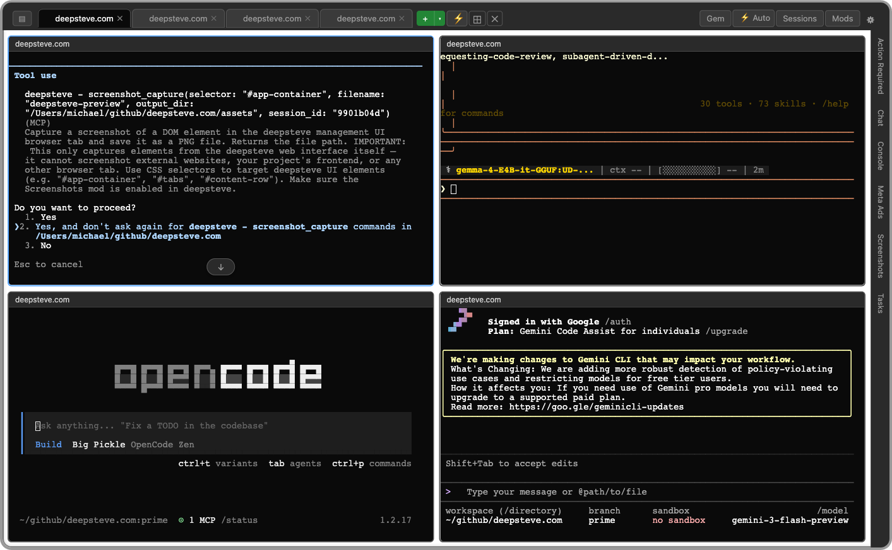

<p align="center">
  
</p>

# deepsteve

https://deepsteve.com

Run multiple AI agent sessions side-by-side in your browser, each with full terminal capabilities and persistent conversation history. Supports **Claude Code** and **Codex (beta)**, with experimental support for **OpenCode**, **Pi**, and **Hermes**.

<p align="center">
  
</p>

<p align="center">
  
  
</p>

**Requires macOS.** deepsteve uses macOS LaunchAgents for daemon management and macOS-specific paths for logs and state.

> **Security notice:** DeepSteve is **localhost-first with token authentication**. Every surface (web UI WebSocket, MCP endpoint, REST APIs) enforces a Host allowlist, an Origin allowlist, and a per-install bearer token — closing the drive-by-webpage / DNS-rebinding hole. The browser is authenticated transparently via an HttpOnly cookie (no login screen). Auth is always on; do not expose it to an untrusted network regardless.

## Terminal Engines

deepsteve currently uses **node-pty** to run agent sessions (Claude Code, Codex beta, and the experimental OpenCode, Pi, and Hermes integrations) as child processes on a Node server, connected to the browser via WebSocket. **tmux** support is currently being implemented as an alternative backend — running sessions inside tmux panes instead of node-pty, enabling native session persistence and detach/reattach without the Node process staying alive.

## Features

- **Multiple sessions** - Open as many Claude Code or Codex beta instances as you need in separate tabs
- **Real terminal emulation** - PTY support via xterm.js.
- **Session persistence** - Conversations survive server restarts and page refreshes
- **GitHub issue picker** - Pick an issue from any repo and launch a session with a worktree and prompt
- **Agent coordination** - MCP tools let sessions chat, share tasks, and coordinate work
- **Runs as a daemon** - Always available in the background on your Mac
- **Themes** - Customize the UI with CSS files in `~/.deepsteve/themes/`
- **Mods** - Extend deepsteve with mods for task tracking, agent chat, browser reflection (yes, deepsteve can see itself), or [create your own](docs/mods.md)

## Quick Install

```bash
curl -fsSL deepsteve.com/install.sh | bash
```

## Requirements

- macOS
- Node.js
- [Claude Code](https://docs.anthropic.com/en/docs/claude-code) or [Codex CLI](https://developers.openai.com/codex/cli/) installed (Codex support is beta; OpenCode, Pi, and Hermes are experimental alternatives)

## Installation (from source)

If you've cloned the repo:

```bash
./release.sh   # generates install.sh from source files
./install.sh   # installs to ~/.deepsteve/
```

`install.sh` is gitignored — it's generated by `release.sh`, which embeds all source files as heredocs. You must run `release.sh` first.

## Usage

Open [http://deepsteve.localhost:3000](http://deepsteve.localhost:3000) in your browser (`*.localhost` resolves to loopback; `http://localhost:3000` also works and redirects there).

- Click **+** to create a new Claude Code or Codex beta session in any directory
- Click the **GitHub icon** to pick an issue — deepsteve creates a worktree and starts a session with the issue as a prompt
- Right-click a tab to rename it
- Use **Shift+Enter** for multi-line input

## Command Palette

Press **⌘K** to open the command palette for quick keyboard-driven access to tabs, settings, and custom commands.

- Type to filter, arrow keys to navigate, Enter to execute
- Built-in commands: New Tab, Close Tab, Settings, Mods, Next/Previous Tab
- Switch between open tabs by name
- Customize the shortcut in Settings → Keyboard

### Custom Commands

Drop executable scripts into `~/.deepsteve/commands/` and they appear automatically in the palette:

```bash
cat > ~/.deepsteve/commands/hello.sh << 'EOF'
#!/bin/bash
echo "Hello from DeepSteve!"
EOF
chmod +x ~/.deepsteve/commands/hello.sh
```

The command name is derived from the filename (hyphens → spaces, title-cased). For custom names, add a JSON sidecar file alongside the script:

```json
// ~/.deepsteve/commands/hello.json
{ "name": "Say Hello", "description": "Prints a friendly greeting" }
```

Scripts receive environment variables: `DEEPSTEVE_SESSION_ID` (active tab's shell ID), `DEEPSTEVE_CWD` (that tab's working directory), `DEEPSTEVE_TAB_NAME`, `DEEPSTEVE_WORKTREE`, `DEEPSTEVE_WINDOW_ID`, `DEEPSTEVE_API_URL`, and `DEEPSTEVE_API_TOKEN` (send as `Authorization: Bearer $DEEPSTEVE_API_TOKEN` when calling the REST API).

## Themes

Customize the UI with CSS theme files. See the [Themes Guide](docs/themes.md) for details.

## Mods

Extend deepsteve with visual mods — alternative views, panels, and MCP tools for your sessions. See the [Mods Guide](docs/mods.md) for details.

## Custom Model Providers (OpenRouter)

Claude Code sessions can run against any Anthropic-compatible API endpoint — OpenRouter, a corporate gateway, a local proxy — using a **custom Claude config profile**. No mod or proxy needed; each profile is just a separate `CLAUDE_CONFIG_DIR` with its own provider env, and tabs opt into it per session.

Example: running [GLM 5.2](https://openrouter.ai/z-ai/glm-5.2) through OpenRouter.

**1. Create a config directory** with a `settings.json` that points Claude Code at the provider:

```bash
mkdir ~/.claude-open-router
cat > ~/.claude-open-router/settings.json <<'EOF'
{
  "env": {
    "ANTHROPIC_BASE_URL": "https://openrouter.ai/api",
    "ANTHROPIC_AUTH_TOKEN": "sk-or-v1-YOUR-OPENROUTER-KEY",
    "ANTHROPIC_API_KEY": "sk-or-v1-YOUR-OPENROUTER-KEY",
    "ANTHROPIC_MODEL": "z-ai/glm-5.2",
    "ANTHROPIC_SMALL_FAST_MODEL": "anthropic/claude-haiku-4.5",
    "ANTHROPIC_DEFAULT_OPUS_MODEL": "anthropic/claude-opus-4.8",
    "ANTHROPIC_DEFAULT_SONNET_MODEL": "anthropic/claude-sonnet-5",
    "ANTHROPIC_DEFAULT_HAIKU_MODEL": "anthropic/claude-haiku-4.5"
  },
  "model": "z-ai/glm-5.2"
}
EOF
```

`ANTHROPIC_MODEL`/`model` pick the main model by the provider's id; the `ANTHROPIC_DEFAULT_*`/`SMALL_FAST` entries map Claude Code's internal model tiers to provider ids so background/fast paths keep working.

**2. Register it in deepsteve**: Settings → **Custom Claude configs** → add a row with a display name (e.g. `OpenRouter`) and the config dir (`~/.claude-open-router`).

**3. Open a tab with it**: the profile appears alongside the agents in the new-tab menu. Sessions started with it spawn Claude Code with `CLAUDE_CONFIG_DIR` pointing at that directory — provider, model, auth, and conversation history all stay isolated per profile, and regular Claude tabs are unaffected.

Note: plain base-URL routing covers normal use. OpenRouter-specific request-body fields (e.g. pinning a backend `provider`) aren't expressible this way — that was proposed as a transform-proxy mod in #499 and closed as not needed in practice.

## Managing the Daemon

```bash
./restart.sh            # restart (browser tabs silently reconnect)
./restart.sh --refresh  # restart + force browser reload

tail -f ~/Library/Logs/deepsteve.log   # view logs
launchctl list | grep deepsteve        # check status
```

## Security

- Binds to `localhost:3000` only by default — not accessible from the network
- **Token-authenticated** on every surface (WebSocket, MCP, REST): a Host allowlist + Origin allowlist + a per-install secret at `~/.deepsteve/auth-token` (`0600`) close the cross-origin / DNS-rebinding hole. The browser gets the token as an HttpOnly cookie; other clients send it as `Authorization: Bearer <token>`. Widen access with `--allow-origin` / `--allow-host`.
- The UI lives on **`http://deepsteve.localhost:3000`** — still loopback-only (RFC 6761), but with its own browser cookie jar so the auth cookie can't be evicted when other local dev apps fill the shared `localhost` jar. Browser navigations to `localhost:3000` get a 302 there; disable with `--no-canonical-redirect` (or `DEEPSTEVE_NO_CANONICAL_REDIRECT=1`) if `*.localhost` doesn't resolve on your system.
- Each agent session runs with the permissions of the user who installed deepsteve

## Running on Meta Quest (WebXR)

WebXR requires a secure context (HTTPS). DeepSteve has built-in HTTPS support for this:

1. Start the server with HTTPS enabled, bound to all interfaces:

```bash
cd ~/.deepsteve && node server.js --bind 0.0.0.0 --https
```

2. Navigate to `https://<your-laptop-ip>:3443` on the Quest browser. The server logs will show the exact URL to use.

3. On first connect you'll see a certificate warning — accept it to proceed. (Install [mkcert](https://github.com/FiloSottile/mkcert) on your laptop for locally-trusted certificates with no warnings.)

Certificates are auto-generated at startup and stored in `~/.deepsteve/certs/`. They regenerate automatically when your LAN IP changes.

## Contributing

Bug reports and feature requests are welcome on [GitHub Issues](https://github.com/deepsteve/deepsteve/issues). Pull requests are welcome.

## Uninstall

```bash
~/.deepsteve/uninstall.sh
```
